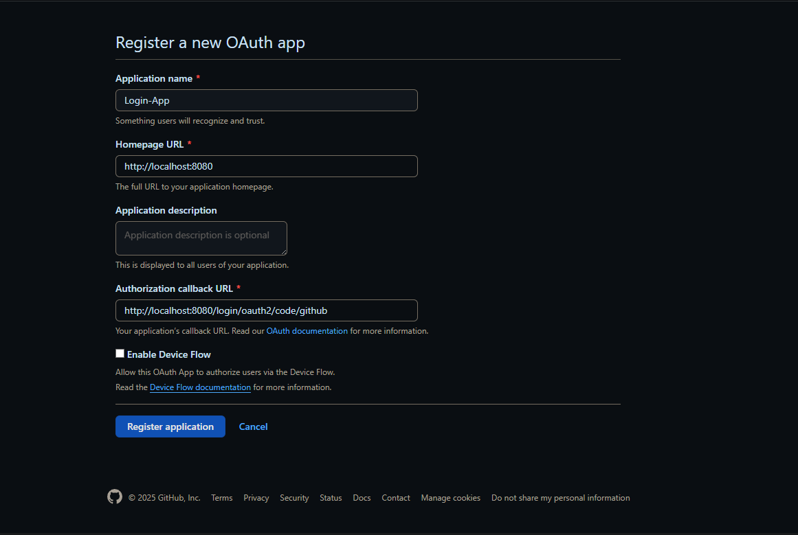

# GitHub OAuth Integration - Spring Boot Demo

##  Sobre o Projeto

Este projeto é uma aplicação web desenvolvida em **Spring Boot** para estudar e compreender como funciona o processo de autenticação OAuth 2.0 utilizando o **GitHub**.

A aplicação realiza a autenticação de usuários via GitHub e quando autenticado, permite acesso a algumas informações dos repositórios do usuário (como lista de repositórios e commits).  
A ideia é integrar esse fluxo futuramente com outra aplicação.

---

##  Tecnologias Utilizadas

- **Java 17**
- **Spring Boot 3.4.5**
- **Spring Security OAuth2 Client** (`spring-boot-starter-oauth2-client`)
- **Spring Web** (`spring-boot-starter-web`)
- **Thymeleaf** (`spring-boot-starter-thymeleaf`)
- **Bootstrap 5.1**
---

##  Configurando um OAuth App no GitHub

Para que a autenticação via GitHub funcione, precisamos configurar um **OAuth App** no GitHub:

1. Acesse [https://github.com/settings/developers](https://github.com/settings/developers).

2. Clique em **"New OAuth App"**.


3. Preencha os campos:
    - **Application name**: Nome da sua aplicação.
    - **Homepage URL**: `http://localhost:8080`
    - **Authorization callback URL**: `http://localhost:8080/login/oauth2/code/github`

   

   > **Importante**: o `callback URL` deve bater exatamente com o configurado na sua aplicação Spring.

4. Após criar, o GitHub mostrará:
    - **Client ID**
    - **Client Secret**

5. Adicione essas informações no seu `application.yml` ou `application.properties` da seguinte forma:

**Exemplo usando `application.yml`:**

```yaml
spring:
  security:
    oauth2:
      client:
        registration:
          github:
            client-id: <ID>
            client-secret: <SECRET>
            scope: repo, read:user
```

**Ou `application.properties`:**

```properties
spring.security.oauth2.client.registration.github.client-id=YOUR_CLIENT_ID
spring.security.oauth2.client.registration.github.client-secret=YOUR_CLIENT_SECRET
spring.security.oauth2.client.registration.github.scope=repo,read:user
```

**Configurando Scope:**

| Scope             | Permissão concedida                                                                          |
|-------------------|----------------------------------------------------------------------------------------------|
| `repo`            | Acesso **completo** a repositórios **privados** e **públicos** (leitura, escrita, exclusão). |
| `read:user`       | Ler dados públicos e privados do perfil do usuário.                                          |
| `user:email`      | Ler o e-mail primário e verificado do usuário.                                               |
| `admin:repo_hook` | Gerenciar webhooks dos repositórios.                                                         |
| `read:org`        | Ler informações das **organizações** que o usuário participa.                                |
| `write:org`       | **Gerenciar** organizações (requer cuidado).                                                 |
| `gist`            | Criar e modificar gists do usuário.                                                          |
| `workflow`        | Controlar execuções de GitHub Actions (Workflows).                                           |

> Importante: Consulte a [documentação](https://docs.github.com/en/apps/oauth-apps/building-oauth-apps/scopes-for-oauth-apps) do GitHub para mais informções.


---

## TODO

- [ ] Refatorar o código
- [ ] Organizar melhor a estrutura de arquivos
- [ ] Modularizar o projeto
- [ ] Separar melhor os endpoints
- [ ] Melhorar o frontend (design e responsividade)

---